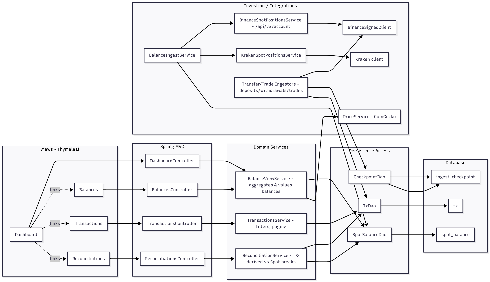

# Cryptio — Crypto Portfolio Tracker

A Spring Boot application to track spot balances across multiple exchanges  
(**Binance** and **Kraken** supported so far).

Balances are ingested via exchange APIs, normalized into a relational schema (managed by **Flyway**), and displayed on a simple **Thymeleaf front page**.

---

## Features

- View current holdings across accounts/exchanges
- One-click **Fetch from Binance/Kraken** to update balances
-  Schema managed with **Flyway** (separate H2/Postgres migrations)
- Vendor-specific quirks (Kraken asset aliases, etc.) handled via `asset_alias`
- Supports in-memory **H2** for dev, **Postgres** for prod
- API keys provided via environment variables

---

## Getting Started

### Requirements
- Java 21 (tested with Corretto 21.0.7)
- Gradle 8+
- (Optional) Docker for running Postgres

## Architecture
[](src/main/resources/docs/architecture-diagram-v1.png)

## Sequence
[](src/main/resources/docs/balance-sequence.jpg)


### Clone & Build
```bash
git clone https://github.com/yourname/cryptio.git
cd cryptio
./gradlew build


## reconcile
3) How to use (sequence)

Backfill (choose your since date):

POST /binance/ingest-trades?account=primary&since=2024-01-01T00:00:00Z
POST /binance/ingest-deposits?account=primary&since=2024-01-01T00:00:00Z
POST /binance/ingest-withdrawals?account=primary&since=2024-01-01T00:00:00Z
POST /binance/ingest-dust?account=primary&since=2024-01-01T00:00:00Z
POST /binance/ingest-convert?account=primary&since=2024-01-01T00:00:00Z
POST /binance/ingest-rewards?account=primary&since=2024-01-01T00:00:00Z


Reconcile:

GET /binance/reconcile?account=primary


You should see deltas shrink substantially. Remaining small differences typically come from:

Funding fee transfers (for margin/futures — if you only use spot, ignore),

Launchpool/Locked Earn nuances (more reward types; they also land in assetDividend),

Timing differences if snapshots were taken mid-flow.